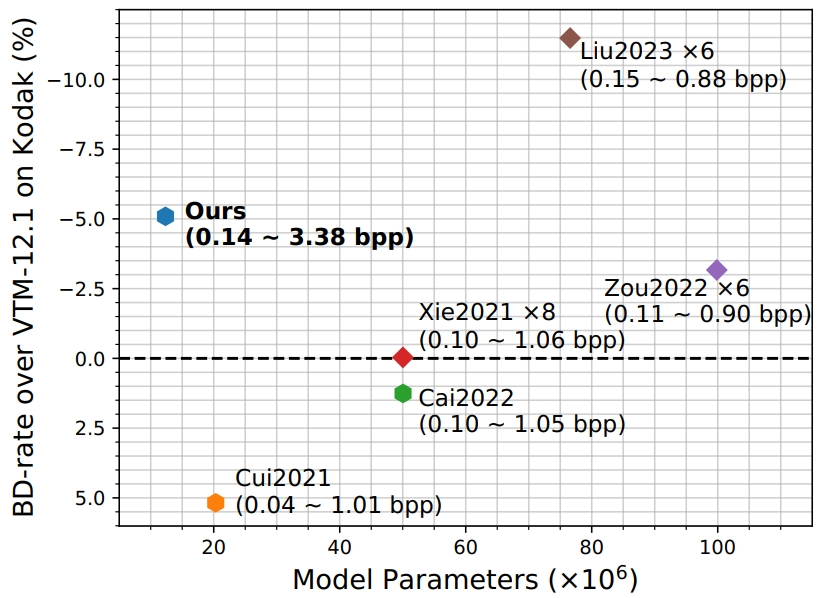
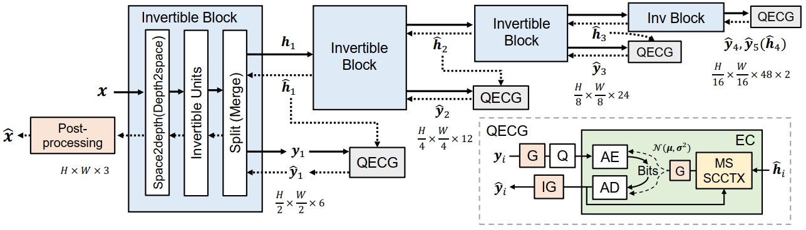
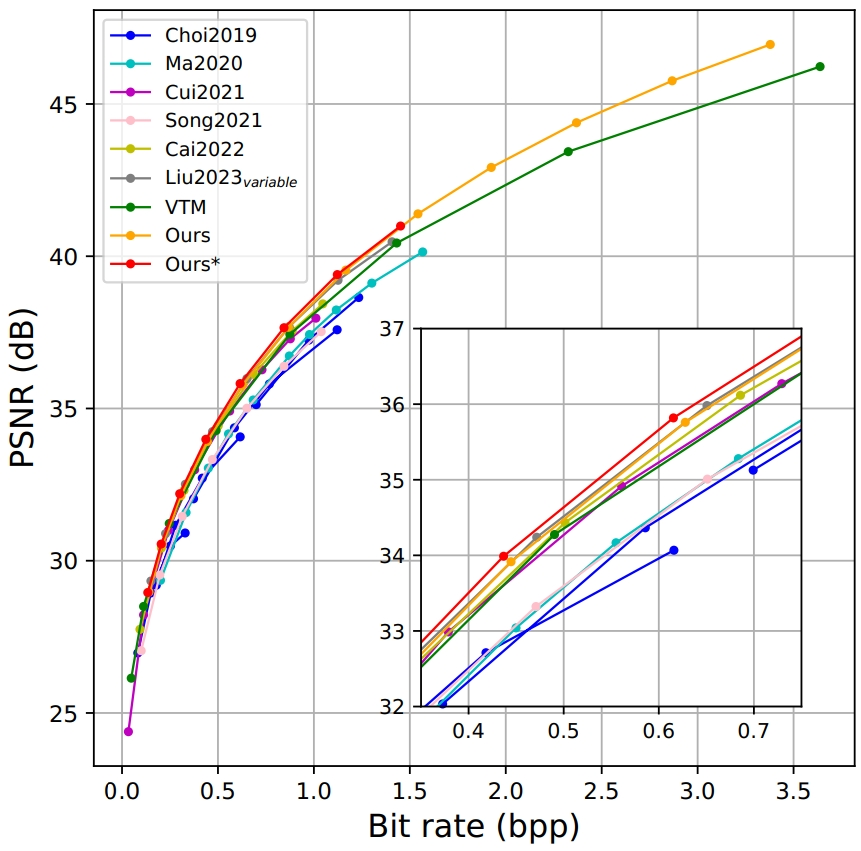
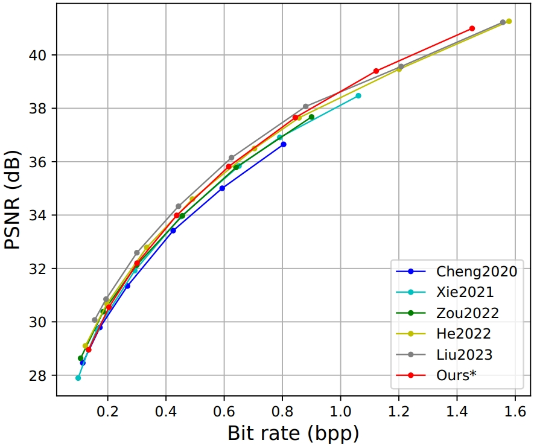

# Multi-Scale Invertible Neural Network for Wide-Range Variable-Rate Learned Image Compression [TMM 2025]

This repository contains the **official implementation** of our paper:  [Multi-Scale Invertible Neural Network for Wide-Range Variable-Rate Learned Image Compression](https://arxiv.org/abs/2503.21284).



## Overview

### Abstract

Autoencoder-based structures have dominated recent learned image compression methods. However, the inherent information loss associated with autoencoders limits their rate-distortion performance at high bit rates and restricts their flexibility of rate adaptation. In this paper, we present a variable-rate image compression model based on invertible transform to overcome these limitations. Specifically, we design a lightweight multi-scale invertible neural network, which bijectively maps the input image into multi-scale latent representations. To improve the compression efficiency, a multi-scale spatial-channel context model with extended gain units is devised to estimate the entropy of the latent representation from high to low levels. Experimental results demonstrate that the proposed method achieves state-of-the-art performance compared to existing variable-rate methods, and remains competitive with recent multi-model approaches. 

### Architecture

The overall framework of our proposed image compression model:



### Performance

**Rate-Distortion (RD) Curves on Kodak.**

Comparison with variable-rate image compression methods across a wider range of bit rates:




Comparison with fixed-rate image compression methods:



## Usage

## Environment

Our implementation is built upon Pytorch and [CompressAI](https://github.com/InterDigitalInc/CompressAI). To install the required dependencies, run:

```
pip install -r requirements.txt
```

### Training

We train our model on the [Flicker2W](https://github.com/liujiaheng/CompressionData) dataset. The dataset is preprocessed following the scripts provided in [this repository](https://github.com/xyq7/InvCompress/tree/main/codes/scripts).

Example: Training from scratch
```
python train.py -d [path of training dataset] --e 750 -lr 1e-4 -b 8 --anchor_num 8 --use_act_norm --lrp --post_process
```
Example: Fine-tuning for a wider bitrate range (e.g. increasing anchor_num from 8 to 12)
```
python train.py -d [path of training dataset] --e 400 -lr 1e-5 -b 8 --anchor_num 12 --use_act_norm --lrp --post_process --finetune
```

### Evaluation

Pre-trained models can be downloaded from [GoogleDrive](https://drive.google.com/drive/folders/1ayRaCPZ9krHEUMDv0ER8e0YW-KqyHJGo?usp=sharing). The Rate-distortion (RD) results on three popular datasets can be found in [RD_data.md](./RD_data.md) for reference.

Example: Running evaluation
```
python eval.py [path of evaluation dataset] --anchor_num 8 --use_act_norm --lrp --post_process -p [path of checkpoint]
```

## Citation
If you find our work useful, please consider citing our paper:
```bibtex
@article{tu2025msinn,
  author    = {Tu, Hanyue and Wu, Siqi and Li, Li and Zhou, Wengang and Li, Houqiang},
  title     = {Multi-Scale Invertible Neural Network for Wide-Range Variable-Rate Learned Image Compression},
  journal   = {IEEE Transactions on Multimedia},
  year      = {2025},
}
```


